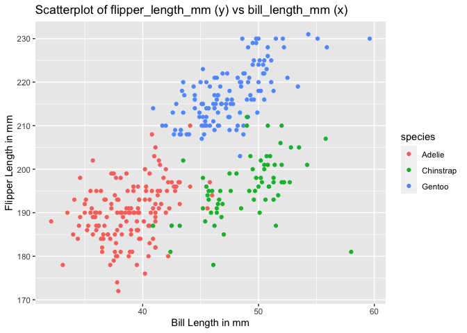

HW1_ys3508
================

# Problem 1

## download the package

## load the penguins dataset

``` r
data("penguins", package = "palmerpenguins")
```

## description of the penguins dataset

the data in this dataset, including names / values of important
variables；

Answer: the variables names are species, island, bill_length_mm,
bill_depth_mm, flipper_length_mm, body_mass_g, sex and year. The
impartant values are in the below table.

``` r
summary(penguins)
```

    ##       species          island    bill_length_mm  bill_depth_mm  
    ##  Adelie   :152   Biscoe   :168   Min.   :32.10   Min.   :13.10  
    ##  Chinstrap: 68   Dream    :124   1st Qu.:39.23   1st Qu.:15.60  
    ##  Gentoo   :124   Torgersen: 52   Median :44.45   Median :17.30  
    ##                                  Mean   :43.92   Mean   :17.15  
    ##                                  3rd Qu.:48.50   3rd Qu.:18.70  
    ##                                  Max.   :59.60   Max.   :21.50  
    ##                                  NA's   :2       NA's   :2      
    ##  flipper_length_mm  body_mass_g       sex           year     
    ##  Min.   :172.0     Min.   :2700   female:165   Min.   :2007  
    ##  1st Qu.:190.0     1st Qu.:3550   male  :168   1st Qu.:2007  
    ##  Median :197.0     Median :4050   NA's  : 11   Median :2008  
    ##  Mean   :200.9     Mean   :4202                Mean   :2008  
    ##  3rd Qu.:213.0     3rd Qu.:4750                3rd Qu.:2009  
    ##  Max.   :231.0     Max.   :6300                Max.   :2009  
    ##  NA's   :2         NA's   :2

the size of the dataset (using nrow and ncol)

``` r
# Nrow/columns in penguins
x = data.frame(penguins)
nrow(x)
```

    ## [1] 344

``` r
ncol(x)
```

    ## [1] 8

the mean flipper length

``` r
penguins %>%
  summarise(mean(flipper_length_mm, na.rm = TRUE))
```

    ## # A tibble: 1 × 1
    ##   `mean(flipper_length_mm, na.rm = TRUE)`
    ##                                     <dbl>
    ## 1                                    201.

``` r
# or

skimr::skim(penguins, flipper_length_mm)
```

|                                                  |          |
|:-------------------------------------------------|:---------|
| Name                                             | penguins |
| Number of rows                                   | 344      |
| Number of columns                                | 8        |
| \_\_\_\_\_\_\_\_\_\_\_\_\_\_\_\_\_\_\_\_\_\_\_   |          |
| Column type frequency:                           |          |
| numeric                                          | 1        |
| \_\_\_\_\_\_\_\_\_\_\_\_\_\_\_\_\_\_\_\_\_\_\_\_ |          |
| Group variables                                  | None     |

Data summary

**Variable type: numeric**

| skim_variable     | n_missing | complete_rate |   mean |    sd |  p0 | p25 | p50 | p75 | p100 | hist  |
|:------------------|----------:|--------------:|-------:|------:|----:|----:|----:|----:|-----:|:------|
| flipper_length_mm |         2 |          0.99 | 200.92 | 14.06 | 172 | 190 | 197 | 213 |  231 | ▂▇▃▅▂ |

Make a scatterplot of flipper_length_mm (y) vs bill_length_mm (x); color
points using the species variable (adding color = … inside of aes in
your ggplot code should help)

``` r
scatterplot1 <- penguins %>%
ggplot2:::ggplot(aes(x = bill_length_mm, y = flipper_length_mm, color = species)) + geom_point() +
ggtitle("Scatterplot of flipper_length_mm (y) vs bill_length_mm (x)") +
ylab("Flipper Length in mm") +
xlab("Bill Length in mm")

scatterplot1
```

    ## Warning: Removed 2 rows containing missing values (geom_point).

<!-- -->

Export scatterplot to project directory using ggsave.

``` r
ggsave("scatterplot1.png")
```

    ## Saving 7 x 5 in image

    ## Warning: Removed 2 rows containing missing values (geom_point).

# Problem 2

a random sample of size 10 from a standard Normal distribution

``` r
set.seed(1234) #set seed

#random sample of size 10
samp = rnorm(10)
samp
```

    ##  [1] -1.2070657  0.2774292  1.0844412 -2.3456977  0.4291247  0.5060559
    ##  [7] -0.5747400 -0.5466319 -0.5644520 -0.8900378

create a data frame

``` r
dataframe <- data.frame(samp)
dataframe
```

    ##          samp
    ## 1  -1.2070657
    ## 2   0.2774292
    ## 3   1.0844412
    ## 4  -2.3456977
    ## 5   0.4291247
    ## 6   0.5060559
    ## 7  -0.5747400
    ## 8  -0.5466319
    ## 9  -0.5644520
    ## 10 -0.8900378

create a logical vector indicating whether elements of the sample are
greater than 0

``` r
dataframe$gt10_logic <- dataframe$samp > 0
dataframe
```

    ##          samp gt10_logic
    ## 1  -1.2070657      FALSE
    ## 2   0.2774292       TRUE
    ## 3   1.0844412       TRUE
    ## 4  -2.3456977      FALSE
    ## 5   0.4291247       TRUE
    ## 6   0.5060559       TRUE
    ## 7  -0.5747400      FALSE
    ## 8  -0.5466319      FALSE
    ## 9  -0.5644520      FALSE
    ## 10 -0.8900378      FALSE

a character vector of length 10

``` r
dataframe$leg10_char <- c(length(10))
dataframe
```

    ##          samp gt10_logic leg10_char
    ## 1  -1.2070657      FALSE          1
    ## 2   0.2774292       TRUE          1
    ## 3   1.0844412       TRUE          1
    ## 4  -2.3456977      FALSE          1
    ## 5   0.4291247       TRUE          1
    ## 6   0.5060559       TRUE          1
    ## 7  -0.5747400      FALSE          1
    ## 8  -0.5466319      FALSE          1
    ## 9  -0.5644520      FALSE          1
    ## 10 -0.8900378      FALSE          1

a factor vector of length 10, with 3 different factor “levels”

``` r
dataframe$level_fact <- factor(c("low", "medium", "high", "low", "medium", "medium", "low","low","low","low"), levels = c("low", "medium", "high"))
dataframe
```

    ##          samp gt10_logic leg10_char level_fact
    ## 1  -1.2070657      FALSE          1        low
    ## 2   0.2774292       TRUE          1     medium
    ## 3   1.0844412       TRUE          1       high
    ## 4  -2.3456977      FALSE          1        low
    ## 5   0.4291247       TRUE          1     medium
    ## 6   0.5060559       TRUE          1     medium
    ## 7  -0.5747400      FALSE          1        low
    ## 8  -0.5466319      FALSE          1        low
    ## 9  -0.5644520      FALSE          1        low
    ## 10 -0.8900378      FALSE          1        low

OR

unsing titble to create the data frame for numeric/character/factor
vector

``` r
dataframe2 = tibble(
  samp,
  gt10_logic = samp > 0,
  leg10_char = c(length(10)),
  level_fact = factor(c("low", "medium", "high", "low", "medium", "medium", "low","low","low","low"), levels = c("low", "medium", "high"))
  )
dataframe2
```

    ## # A tibble: 10 × 4
    ##      samp gt10_logic leg10_char level_fact
    ##     <dbl> <lgl>           <int> <fct>     
    ##  1 -1.21  FALSE               1 low       
    ##  2  0.277 TRUE                1 medium    
    ##  3  1.08  TRUE                1 high      
    ##  4 -2.35  FALSE               1 low       
    ##  5  0.429 TRUE                1 medium    
    ##  6  0.506 TRUE                1 medium    
    ##  7 -0.575 FALSE               1 low       
    ##  8 -0.547 FALSE               1 low       
    ##  9 -0.564 FALSE               1 low       
    ## 10 -0.890 FALSE               1 low

take the mean of each variable in dataframe

``` r
mean(dataframe$samp)
```

    ## [1] -0.3831574

``` r
mean(dataframe$gt10_logic)
```

    ## [1] 0.4

``` r
mean(dataframe$leg10_char)
```

    ## [1] 1

``` r
mean(dataframe$level_fact)
```

    ## Warning in mean.default(dataframe$level_fact): argument is not numeric or
    ## logical: returning NA

    ## [1] NA
